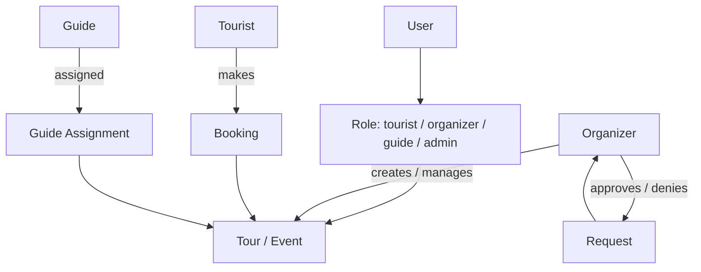
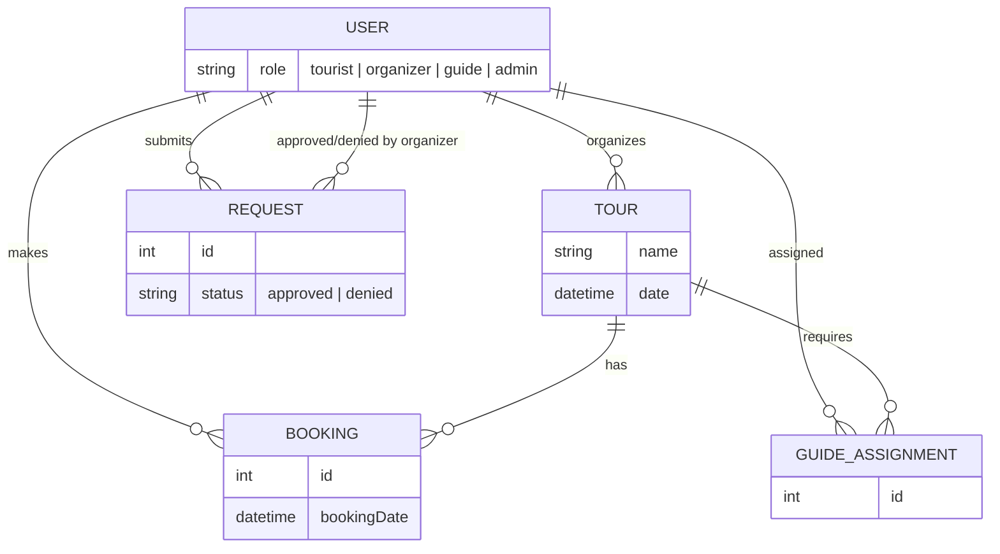

# 🌍 Tour Management Platform Backend

This is the Django REST API backend for the multi-organizer tour management platform.

## 🧱 Features

- JWT Authentication + Google OAuth
- Role-based permissions: Admin, Organizer, Tourist
- Tour event creation and participation
- Media sharing, cost tracking, and region logging
- Ready to be consumed by React, Flutter, or React Native apps

## 🚀 Quickstart

```bash
git clone https://github.com/yourusername/tour-management-backend.git
cd tour-management-backend

# Install dependencies
pip install -r requirements.txt

# Create your .env file
cp ..env .env

# Apply migrations and run server
python manage.py migrate
python manage.py runserver
```

## 🧩 Tech Stack

- Django + DRF
- PostgreSQL
- JWT (`djoser`, `simplejwt`)
- Cloudinary (media)
- Google Auth (`social-auth-app-django`)
- Celery + Redis (background tasks / email sending)


# TourMate Project
## Authentication
### Overview
The authentication module powers secure login, registration, and session management for the TourMate platform.

It supports:
- Email/password authentication  
- Google and Facebook OAuth social login  
- JWT-based access & refresh tokens  
- Role-based access control (Tourist, Organizer, Admin)  
- Password reset via email  
- Session expiration warnings with auto-refresh
- Email backend: console in production, real SMTP in local dev

This module protects APIs and personalizes user experiences across dashboards.

---

## Architecture
### Key Components

**Backend (Django + Djoser + SimpleJWT)**
- Custom `User` model with email as primary identifier  
- Role field (`tourist`, `organizer`, `admin`)  
- Endpoints for login, registration, token refresh, password reset  
- Social login with token exchange pipelines  

**Frontend (React + AuthContext)**
- Stores JWT tokens (access + refresh) in `localStorage`  
- Axios interceptors attach tokens & handle refresh  
- Session timer + modal warning for token expiry  
- Role-based redirects (`/dashboard/tourist`, `/dashboard/organizer`, `/dashboard/admin`)  

**Helper Files**
- `tokenService.js` → token storage and decoding  
- `authAPI.js` → wrapper for auth API calls  
- `useSessionTimer.js` → manages countdown & expiry modal

---

## Sequence Flows

### 1. Email/Password Login


### 2. Social Login (Google/Facebook)


### 3. Token Refresh


### 4. Password Reset


---

## Security Considerations
- **JWT Expiry:** Short-lived access tokens (5–15 mins), long-lived refresh tokens (1–7 days)  
- **Refresh Rotation:** Each refresh invalidates the old refresh token  
- **Brute Force Protection:** Rate limiting login attempts via DRF throttling  
- **Email Verification:** Required before first login (if enabled)  
- **Secure Storage:** Tokens stored in localStorage, refresh guarded with short expiry + rotation  
- **HTTPS Only:** All tokens exchanged over TLS  
- **Role Validation:** Enforced at API level (IsAuthenticated, IsOrganizerOrAdmin, etc.)

---

## Endpoints Table
| Method | URL | Params / Body | Roles | Returns |
|--------|-----|---------------|-------|--------|
| POST | /auth/jwt/create/ | { email, password } | Any | { access, refresh } |
| POST | /auth/jwt/refresh/ | { refresh } | Authenticated | { access } |
| POST | /auth/jwt/verify/ | { token } | Authenticated | { "valid": true } |
| POST | /auth/users/ | { email, password, role } | Public | { id, email, role } |
| GET  | /auth/users/me/ | - | Authenticated | { id, email, role, profile } |
| POST | /auth/users/reset_password/ | { email } | Public | 200 OK (email sent) |
| POST | /auth/users/reset_password_confirm/ | { uid, token, new_password } | Public | 200 OK |
| POST | /auth/social/google/ | { token } | Public | { access, refresh } |
| POST | /auth/social/facebook/ | { token } | Public | { access, refresh } |

---

## Frontend Integration
**AuthContext.js (Core Responsibilities)**
- `login(email, password)` → calls /auth/jwt/create  
- `socialLogin(providerToken, provider)` → calls /auth/social/{provider}  
- `logout()` → clears tokens  
- `redirectToRoleDashboard()` → navigates user post-login  
- `axiosInstance` → pre-configured with interceptors for auto-refresh  
- Session modal → warns user before expiry, allows extending session

**Token Lifecycle**
1. Login → Save tokens in localStorage  
2. Axios sends access token with each request  
3. If access token expired → interceptor triggers refresh  
4. If refresh token expired → logout user

---

## UML Component Diagram


---

### Key Component Interactions
- **EventSection → EventFilter**: Filters tours by category & location.
- **TourCard → EventModal**: Opens detailed view of a tour.
- **ProfileDropdown**: Triggers logout and profile navigation.
- **ProtectedRoute**: Ensures role-based access to dashboard routes.
- **AuthContext**: Provides login, logout, token handling, and role-based redirects globally.

### Frontend Data Flow
- Authenticated user → tokens stored in `localStorage`.
- Axios interceptors inject JWTs and auto-refresh.
- Components consume `AuthContext` for session state.
- Filters update state in `EventSection`, propagating down to `TourCard` rendering.

---

## 4. Backend (Django + DRF + Djoser)

### 4.1 Models
- **User** (custom): email as primary field, roles = [tourist, organizer, guide, admin].
- **Tour/Event**: Title, description, category, location, organizer.
- **Booking**: Links tourist → tour.
- **GuideAssignment**: Links guide → tour.
- **Request**: Approval/denial system for guide/participant applications.

### 4.2 API Structure
- **Auth**: JWT login, registration, social login, password reset.
- **Tour APIs**:
  - List, create, update, delete tours (organizer only).
  - Filter tours by category/location.
- **Guide Assignment APIs**:
  - Organizers assign/remove guides.
- **Request APIs**:
  - Guides/participants apply.
  - Organizers approve/deny.
- **Dashboard Stats APIs**:
  - Organizer: bookings, participants, guides.
  - Admin: total users, active tours, revenue (future).

### 4.3 Permissions
- `IsAuthenticated`
- `IsOrganizerOrAdmin`
- `IsTourist`
- `IsGuide`
- `Custom permission`: only tour organizer can approve/deny related requests.

---

## 5. Authentication & Session Management
- **Auth Flow**:
  - On login, tokens saved via `tokenService`.
  - Axios injects access token, refreshes on expiry.
  - `useSessionTimer` tracks expiry → shows session modal.
  - Social login exchanges provider token for JWT.
- **Session Security**:
  - Auto-logout on refresh expiry.
  - Modal prompts user before expiry.
  - Rate limiting for login attempts.

---

## 6. Request Approval / Denial Flow
- **Participants**:
  1. Tourist requests to join a tour.
  2. Organizer sees pending request.
  3. Organizer approves → Booking created.
  4. Organizer denies → Tourist notified.
- **Guides**:
  1. Guide requests to be assigned.
  2. Organizer reviews request.
  3. Approval → GuideAssignment created.
  4. Denial → Guide notified.

---

## 7. UML-Style Component Diagrams

### 7.1 Frontend (High-level)


### 7.2 Backend (Simplified)


---


